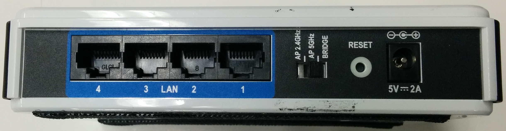

To reset, press and hold the reset button for 10 seconds while the router in on.

Connect via wired ethernet.  Set the computer's IP address to 192.168.0.100.  You can then browse the router at 192.168.0.50 (even though the Dlink docs say 192.168.0.1).

The default user name is `Admin`, and the password is blank.

